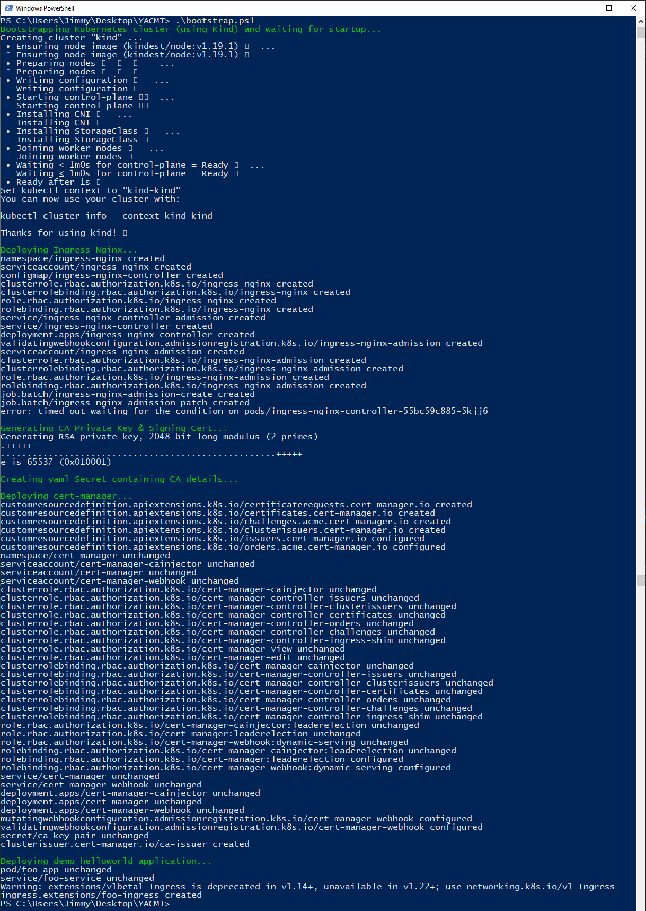
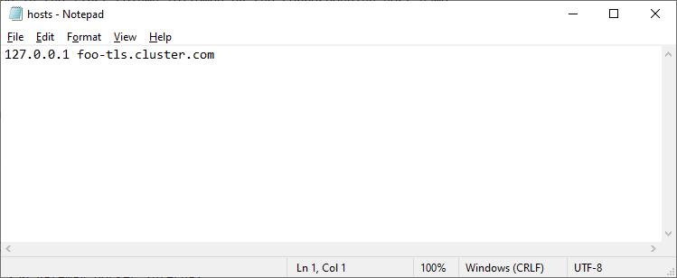
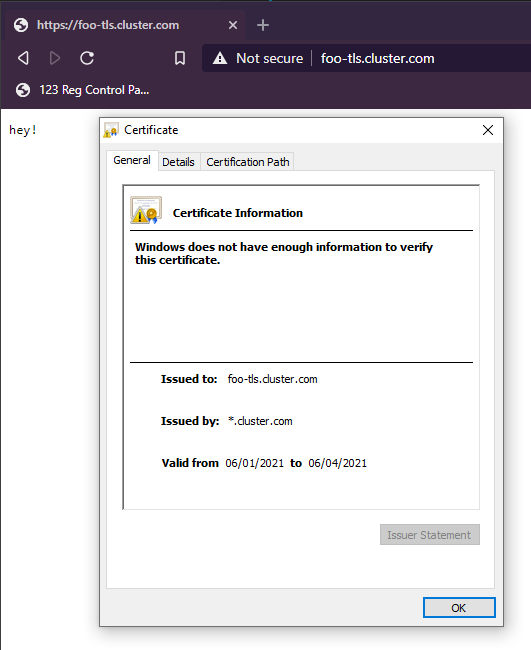

# YACMT (Yet Another Cert-Manager Tutorial)
Yet Another Cert-Manager Tutorial - a simple project to build a local Kubernetes cluster (using Kind), install ingress-nginx as an Ingress Controller, create a self-signed CA with openssl and configure cert-manager on the cluster, and deploy a demo helloworld application all within a couple of minutes.

## Get Started
### 1. Bootstrap Script
To act as a single entrypoint I've put together a small Powershell script that will bootstrap all of the above, which looks something like this:

Simply run:
`.\bootstrap.ps1`

which will output the following:

### 2. Fiddle the hosts file
One slight flaw in the plan here is that when running Kind locally with Nginx, services are accessed via `localhost/<ingress path>`, but this won't match our Ingress definition so Nginx won't serve the correct certificate and will instead serve the default wildcard. As a workaround I modified my host file with the following:

### 3. Head to the app
Our app should be up and running, and hosted at: [https://foo-tls.example.com](https://foo-tls.example.com). If we checkout the certificate we should see a nice short-lived certificate issued to our application. Success!

